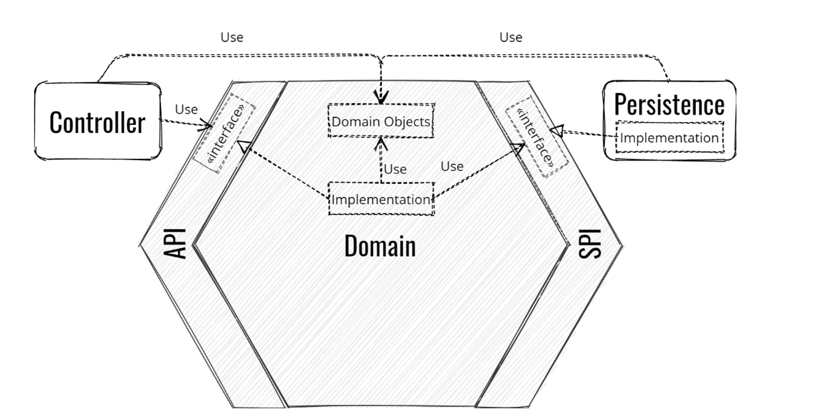

# Architecture Hexagonal Approach

Boa noite, meu povo de DEUS.
Mais uma pra conta, hoje falaremos sobre arquitetura hexagonal, ou ports and adapters que é o sub titulo desse design arquitetural.

E lá vem história …
–Esse conceito foi criado por Alistair Cockburn , sua proposta fundamental é poder contornar o acoplamento e fluxo de dados entre as camadas que compõe a estrutura interna no contexto de um software. Pois define a organização do código em forma de design.

Objetivos práticos …

Imaginemos um problema à ser resolvido, e esse problema aponta criação de um sistema de informação, ou podemos também chamar de domínio do problema, como identifica do DDD (Domain Driven Design, se quiserem algum papo sobre esse assunto, comenta aqui no post), nesse caso podem surgir várias visão, contextos e fronteiras que esse problema apresenta.

Mas também entende-se que, toda e qualquer solução deve e irá surgir para o fim necessário que é resolver cada problema apresentado dentro desse domínio. E tendo isso como verdade, podemos dizer que, não importa quais as ferramentas serão usadas, o problema não vai mudar de complexidade, de entendimento e muito menos a forma de solucioná-lo.

Quando levado para o lado tecnológico, deve-se entender que o núcleo da solução deve ser agnóstico as processos de entradas e saídas das informações, tecnologias envolvidas e frameworks, base de armazenamento, etc.

–Em seu site, o criador desse conceito de arquitetura hexagonal fala assim:

–“Crie seu aplicativo para funcionar sem uma interface do usuário ou um banco de dados para que você possa executar testes de regressão automatizados no aplicativo, trabalhar quando o banco de dados ficar indisponível e vincular aplicativos sem qualquer envolvimento do usuário”.

Em outras palavras ele quer dizer que, não importa como essas informações serão processadas pela aplicação, ou até mesmo armazenadas, o que importa é que, a solução do domínio do problema deve permanecer indiferente ao mundo externo.

Componentes e agentes integradores que definem a arquitetura hexagonal:

1 - Adaptadores - Adapters
2 - Portas - Ports
3 - Domínio - Domain
4 - Casos de Uso - Use Case

### Uma imagem vale mais do que mil palavras …

Créditos da imagem - <https://reflectoring.io/spring-hexagonal/>

* Adaptadores / Adapters : Controladores, Linha de comando (curl por exemplo), interface web …

    * Primário: Inicial o processo de envio de dados do mundo exterior ao centro da aplicação, são por esses adaptadores que classes de controles, execuções via CLI ou console enviam dados para serem processados no núcleo da aplicação.
    * Secundário: Inicial o processo de saída da aplicação para o mundo externo, ou seja, se precisamos de uma informação em uma banco de dados, em outro sistema, em uma fila ou tópico na nuvem etc

* Portas / Ports : Interfaces que definem os contratos pelos quais os adaptadores passam para interagir com os Use Cases (Casos de Uso, que veremos à seguir), temos as portas de entradas e porta de saídas, que correspondem na ordem dos adaptadores de entrada e saída respectivamente nessa ordem.
* Domínio / Domain: São agenda/classes que possuem caráter rico, ou seja, são por meio desses objetos que as regras de negócio são processas, ou pelo menos deveria ser já que nesse conceito os domínios não são objetos anêmicos.
  * Objetos anêmicos: São os chamados objetos burros ou para os mais antigos os POJO se tratando do Java, que é nosso caso de exemplo. Os POJO ou Plain Old Java Object são classes que apenas possuem métodos assessores e modificadores com construtor default.

* Casos de Uso / Use Cases: Os casos de uso ou use case processam as regras de negócio da aplicação. Recebem as informações de entrada, identificam seu processamento, chamam os objetos de domínio responsável pela execução interna da aplicação e enviar por meio da porta de saída o resultado do processamento.

Na imagem do hexágono, estão presentes os pontos discutidos acima, porém dois deles que ainda não apresentados, são eles API e SPI. Interface de Programação de Software (API) e Interface de Programação de Serviço (SPI) são dois tipos diferentes de interfaces usadas para interagir com aplicativos de software.

A API é uma interface que permite que os aplicativos se comuniquem entre si, enquanto o SPI é uma interface que permite que os aplicativos interajam com um serviço. Tanto APIs quanto SPIs são usados ​​para facilitar a comunicação entre aplicativos, mas possuem algumas diferenças importantes.

Diferenças entre API e SPI

De forma simples, a diferença entre API e SPI é que uma API prover interfaces para iteração entre aplicações e mudança de dados entre elas, já uma SPI prover um conjunto de regras e protocolos que permite aplicações realizarem comunicação com outros serviços e interagir com estes.

Regras de Dependência

Um dos nomes mais importantes quando falamos de modelos arquiteturais e criador da clean architecture (escrevi um pequeno artigo sobre nesse link) ou arquitetura limpa, Uncle Bob diz em seu artigo:

“O nome de um elemento declarado em uma camada externa não deve ser mencionado pelo código de uma camada interna. Isso inclui funções, classes, variáveis e qualquer outro elemento de código.”

Ainda afirmando que, o sentido de uma chamada ao centro da aplicação é único. Ou seja, nenhuma camada mais interna pode saber absolutamente nada sobre camadas mais externas, o que envolve todos esses elementos mencionados na citação acima.

Exemplo de uma requisição passando pelos pontos apresentados.

Analisando a imagem acima, podemos perceber a definição em execução. Identificamos os pontos de entrada de dados, conversão de tipos para obedecer o conceito, execução/processamento do caso de uso por meio dos objetos de domínio, conversão para entidade persistente e chamada externa ao banco de dados por meio do adaptador secundário para iniciar o processo transacional na base de dados, nesse caso.

### Links Bibliografia

<https://www.happycoders.eu/software-craftsmanship/hexagonal-architecture/>

<https://alistair.cockburn.us/hexagonal-architecture/>

<https://beyondxscratch.com/2020/08/23/hexagonal-architecture-example-digging-a-spring-boot-implementation/>

<https://www.alibabacloud.com/topic-center/dev-faq/4kuk9vezfjj-difference-between-spi-and-api>

<https://engsoftmoderna.info/artigos/arquitetura-limpa.html#:~:text=1.5%20Regra%20de%20Depend%C3%AAncia&text=No%20seu%20livro%2C%20Uncle%20Bob,qualquer%20outro%20elemento%20de%20c%C3%B3digo>

